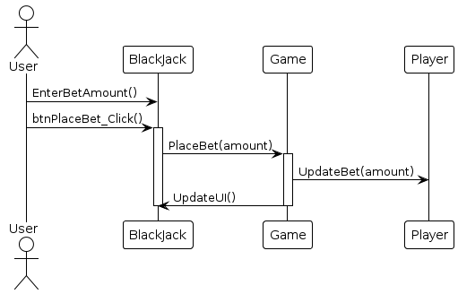
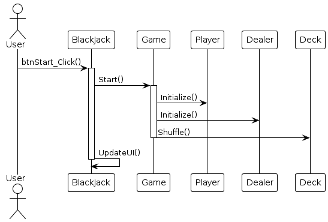
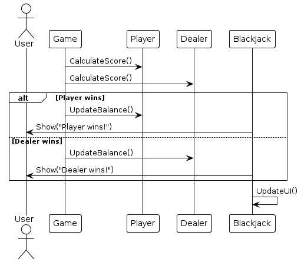
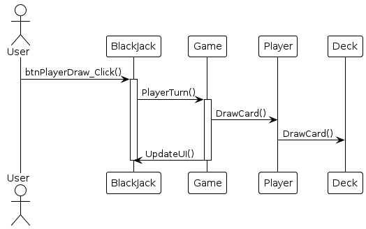
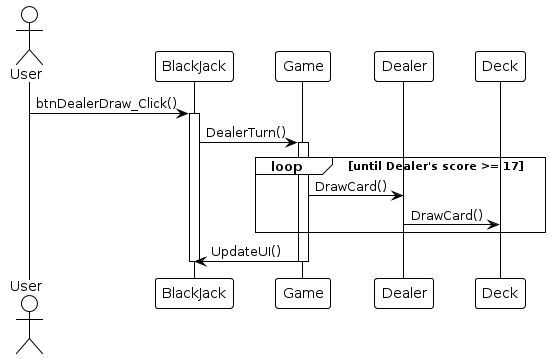
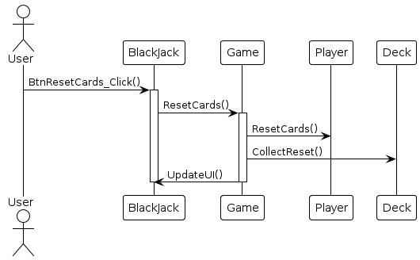

Прецедент «Сделать ставку»

|**Операция**|**Ссылки**|**Описание**|**Предусловие**|**Постусловие**|
| :-: | :-: | :-: | :-: | :-: |
|EnterBetAmount()|Прецедент «Сделать ставку»|Игрок вводит сумму ставки|Игра начата|Ввод суммы ставки|
|btnPlaceBet\_Click()|Прецедент «Сделать ставку»|Игрок нажимает кнопку "Сделать ставку"|Введена сумма ставки и она прошла валидацию|Ставка принята|
|PlaceBet()|Прецедент «Сделать ставку»|Ставка регистрируется в игре|Введена сумма ставки и она прошла валидацию|Ставка зарегистрирована|
|UpdateBet()|Прецедент «Сделать ставку»|Ставка закрепляется за игроком|Введена сумма ставки и она прошла валидацию|Ставка закреплена за игроком|
|UpdateUI()|Прецедент «Сделать ставку»|Обновление интерфейса|Выполнены все прошлые действия|Обновление интерфейса|

Прецедент «Начать игру»

|**Операция**|**Ссылки**|**Описание**|**Предусловие**|**Постусловие**|
| :-: | :-: | :-: | :-: | :-: |
|btnStart\_Click()|Прецедент «Начать игру»|Игрок нажимает на кнопку "Начать"|Игра запущена|Переход к игре|
|Start()|Прецедент «Начать игру»|Интерфейс обращается к методу старт класса "Игра"|Игра запущена|Обновление интерфейса|
|Initialize()|Прецедент «Начать игру»|Игра инициализирует игрока|Игра запущена|Игрок инициализирован|
|Initialize()|Прецедент «Начать игру»|Игра инициализирует дилера|Игра запущена|Дилер инициализирован|
|Shuffle()|Прецедент «Начать игру»|Перетасовка колоды карт|Игра запущена, колода существует|Колода перетасована|
|UpdateUI()|Прецедент «Начать игру»|Обновление интерфейса|Выполнены все прошлые действия|Обновление интерфейса|

Прецедент «Определение победителя»

|**Операция**|**Ссылки**|**Описание**|**Предусловие**|**Постусловие**|
| :-: | :-: | :-: | :-: | :-: |

|CalculateScore()|Прецедент «Определение победителя»|Вычисление счета игрока и дилера|Окончание раунда|Счета вычислены|
| :- | :- | :- | :- | :- |

|UpdateBalance()|Прецедент «Определение победителя»|Обновление баланса игрока или дилера|Вычисление счета|Баланс обновлен|
| :- | :- | :- | :- | :- |

|Show()|Прецедент «Определение победителя»|Отображение результата игроку|Баланс обновлен|Результат показан игроку|
| :- | :- | :- | :- | :- |

|UpdateUI()|Прецедент «Определение победителя»|Обновление интерфейса|Результат показан|Обновление интерфейса|
| :- | :- | :- | :- | :- |

Прецедент «Удвоить ставку»

|**Операция**|**Ссылки**|**Описание**|**Предусловие**|**Постусловие**|
| :-: | :-: | :-: | :-: | :-: |

|btnDoubleDown\_Click()|Прецедент «Удвоить ставку»|Игрок нажимает кнопку "Double Down"|Игра начата|Ставка удвоена|
| :- | :- | :- | :- | :- |

|DoubleDown()|Прецедент «Удвоить ставку»|Удвоение ставки|Нажата кнопка "Double Down"|Ставка удвоена|
| :- | :- | :- | :- | :- |

|DoubleBet()|Прецедент «Удвоить ставку»|Удвоение ставки игрока|Начато удвоение ставки|Ставка удвоена|
| :- | :- | :- | :- | :- |

|DrawCard()|Прецедент «Удвоить ставку»|Игрок берет одну карту|Ставка удвоена|Карта добавлена к руке игрока|
| :- | :- | :- | :- | :- |

|UpdateUI()|Прецедент «Удвоить ставку»|Обновление интерфейса|Выполнены все прошлые действия|Обновление интерфейса|
| :- | :- | :- | :- | :- |

Прецедент «Остаться при своих картах»

|**Операция**|**Ссылки**|**Описание**|**Предусловие**|**Постусловие**|
| :-: | :-: | :-: | :-: | :-: |

|btnStand\_Click()|Прецедент «Остаться при своих картах»|Игрок нажимает кнопку "Stand"|Игра начата|Игрок остается при своих картах, ход переходит к дилеру|
| :- | :- | :- | :- | :- |

|PlayerStands()|Прецедент «Остаться при своих картах»|Игрок выбирает остаться при своих картах|Нажата кнопка "Stand"|Ход переходит к дилеру|
| :- | :- | :- | :- | :- |

|CompleteTurn()|Прецедент «Остаться при своих картах»|Завершение хода дилера|Игрок остался при своих картах|Дилер завершает ход|
| :- | :- | :- | :- | :- |

|UpdateUI()|Прецедент «Остаться при своих картах»|Обновление интерфейса|Выполнены все прошлые действия|Обновление интерфейса|
| :- | :- | :- | :- | :- |

Прецедент «Игрок берет карту»

|**Операция**|**Ссылки**|**Описание**|**Предусловие**|**Постусловие**|
| :-: | :-: | :-: | :-: | :-: |

|btnPlayerDraw\_Click()|Прецедент «Игрок берет карту»|Пользователь нажимает кнопку "Draw Card"|Игра начата|Игрок берет карту|
| :- | :- | :- | :- | :- |

|PlayerTurn()|Прецедент «Игрок берет карту»|Ход игрока|Нажата кнопка "Draw Card"|Игрок берет карту|
| :- | :- | :- | :- | :- |

|DrawCard()|Прецедент «Игрок берет карту»|Игрок берет карту из колоды|Ход игрока|Карта добавлена к руке игрока|
| :- | :- | :- | :- | :- |

|UpdateUI()|Прецедент «Игрок берет карту»|Обновление интерфейса|Завершение хода игрока|Обновление интерфейса|
| :- | :- | :- | :- | :- |

Прецедент «Дилер берет карту»

|**Операция**|**Ссылки**|**Описание**|**Предусловие**|**Постусловие**|
| :-: | :-: | :-: | :-: | :-: |

|btnDealerDraw\_Click()|Прецедент «Дилер берет карту»|Пользователь нажимает кнопку "Dealer Draw"|Игра начата|Дилер начинает брать карты|
| :- | :- | :- | :- | :- |

|DealerTurn()|Прецедент «Дилер берет карту»|Ход дилера|Нажата кнопка "Dealer Draw"|Дилер берет карты до достижения порога|
| :- | :- | :- | :- | :- |

|DrawCard()|Прецедент «Дилер берет карту»|Дилер берет карту из колоды|Ход дилера|Карта добавлена к руке дилера|
| :- | :- | :- | :- | :- |

|UpdateUI()|Прецедент «Дилер берет карту»|Обновление интерфейса|Завершение хода дилера|Обновление интерфейса|
| :- | :- | :- | :- | :- |

Прецедент «Сбросить карты»

|**Операция**|**Ссылки**|**Описание**|**Предусловие**|**Постусловие**|
| :- | :- | :- | :- | :- |

|btnDiscard\_Click()|Прецедент «Сбросить карты»|Игрок нажимает кнопку "Discard"|Игра начата|Карты игрока сброшены|
| :- | :- | :- | :- | :- |

|DiscardCards()|Прецедент «Сбросить карты»|Сброс карт игрока|Нажата кнопка "Discard"|Карты игрока сброшены|
| :- | :- | :- | :- | :- |

|DiscardHand()|Прецедент «Сбросить карты»|Игрок сбрасывает карты|Начат сброс карт|Карты сброшены|
| :- | :- | :- | :- | :- |

|CollectDiscards()|Прецедент «Сбросить карты»|Сбор сброшенных карт в колоду|Карты сброшены|Сброшенные карты собраны|
| :- | :- | :- | :- | :- |

|UpdateUI()|Прецедент «Сбросить карты»|Обновление интерфейса|Выполнены все прошлые действия|Обновление интерфейса|
| :- | :- | :- | :- | :- |

